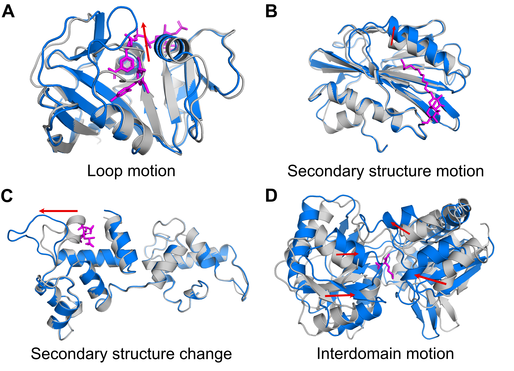

# PocketMiner

PocketMiner is a tool for predicting the locations of cryptic pockets from single protein structures.

PocketMiner is built using the architecture first published in [Learning from Protein Structure with Geometric Vector Perceptrons](https://arxiv.org/abs/2009.01411) by B Jing, S Eismann, P Suriana, RJL Townshend, and RO Dror.

This repository is meant to serve two purposes. If you would like to make predictions on large numbers of structures, we provide a utility script for making predictions. If you would like to use our network for other proteins structure prediction tasks (i.e., use a transfer learning approach), we provide the weights of our final model and instructions on how to fine tune the model for your prediction task.

## Requirements
* UNIX environment
* python==3.7.6
* numpy==1.18.1
* scipy==1.4.1
* pandas==1.0.3
* tensorflow==2.1.0
* tqdm==4.42.1
* mdtraj==1.9.7

We have tested the code with tensorflow versions 2.6.2 and 2.9.1 as well and find that is compatible with these more recent version of tensorflow.

No special hardware is required to run this software.

## Installation
First, clone the PocketMiner repository
```
git clone https://github.com/Mickdub/gvp.git
git switch pocket_pred
```
Then prepare a conda environment (you can use pip and the `linux-requirements.txt` file if you would like) that contains tensorflow, mdtraj, and numpy.
```
conda env create -f pocketminer.yml
conda activate pocketminer
```
There is also a Linux specific `.yml` file called `tf-linux.yml` that may be used by Linux users. Typcially, preparing a conda environment with the required dependencies requires only a minute. Please note that we have removed version number requirements from the `pocketminer.yml` file as we found that this worked better across operating systems. We have tested setup on Linux and MacOS. We will try to validate these instructions for Windows computers shortly.

## Cryptic pocket predictions demo
To use the PocketMiner model, we recommend considering using its web interface (https://pocket-miner-ui.azurewebsites.net/). If however you would like to test the code directly or run predictions on a large number of structures, we suggest modifying the input of `xtal_predict.py` in the `src` directory. There are flags containing `TO DO` that will guide where the code needs to be modified.

There is a demo PDB file in the repository that is used in `xtal_predict.py` (a PDB file of the human protein ACE2). In the code below, simply specify where you would like to send the output. This code will generate a numpy file as well as text file with a prediction for each residue in the input structure:

```
    # TO DO - provide input pdb(s), output name, and output folder
    strucs = [
        '../data/ACE2.pdb',
    ]
    output_name = 'ACE2'
    output_folder = '.'
```
Once you have cloned the repository and created a conda environment, enter the directory and run 
```
cd src
python xtal_predict.py
```
Running this script should only take a few seconds on a standard computer (a GPU is not required for making predictions but is preferred for new model training).

Currently, modifying the `strucs` list to contain multiple structures is not supported (though we will build this functionality in an upcoming update). We recommend looping over the entire main method if you would like to make predictions for multiple structures.


## Transfer learning with the PocketMiner
The following code is needed to create a model object and load the weights from a checkpoint file:

```
from models import MQAModel
from util import load_checkpoint

# MQA Model used for selected NN network
DROPOUT_RATE = 0.1
NUM_LAYERS = 4
HIDDEN_DIM = 100
model = MQAModel(node_features=(8, 50), edge_features=(1, 32),
                 hidden_dim=(16, HIDDEN_DIM),
                 num_layers=NUM_LAYERS, dropout=DROPOUT_RATE)

# Load weights from checkpoint file
nn_path = "models/pocketminer"

load_checkpoint(model, tf.keras.optimizers.Adam(), nn_path)

```

Then, you can continue training the model. Please refer to `train_xtal_predictor.py` for an example of how to write a training loop. There are also multiple class balancing schemes implemented in that file.

## PocketMiner cryptic pocket dataset and negative examples
We have created a novel dataset of cryptic pockets. We filtered the Protein Data Bank (PDB) to identify 38 apo-holo protein structure pairs containing 39 cryptic pockets with large root mean square deviations between apo and holo. The resulting collection of cryptic pockets, called the PocketMiner dataset, includes pockets formed by multiple types of conformational changes. Furthermore, we have generated a dataset of 'negative examples' (i.e. residues that are highly unlikely to participate in cryptic pocket formation). The details of how these 'negative examples' were generated can be found in the [manuscript](https://www.nature.com/articles/s41467-023-36699-3).



These cryptic pocket and negative examples can be used to validate models trained to predict cryptic pockets. The `src/test_performance_on_xtal_residues.py` script showcases code that was used to test our model. In the `data/pm-dataset` folder we have included files containing the labels for each apo (ligand-free) PDB entry as well as a file that contains the PDB IDs with chainids. The chainids are required to access the cleaned structures found in `data/pm-dataset/apo-structures`.

The following code loads up the dictionaries and PDBs with chainids:
```
    val_label_dictionary = np.load('/project/bowmore/ameller/projects/pocket_prediction/data/val_label_dictionary.npy',
                               allow_pickle=True).item()
    val_set_apo_ids_with_chainids = np.load('/project/bowmore/ameller/projects/'
                                            'pocket_prediction/data/val_apo_ids_with_chainids.npy')
    
    test_label_dictionary = np.load('/project/bowmore/ameller/projects/pocket_prediction/data/test_label_dictionary.npy',
                                    allow_pickle=True).item()
    test_set_apo_ids_with_chainids = np.load('/project/bowmore/ameller/projects/'
                                             'pocket_prediction/data/test_apo_ids_with_chainids.npy')
```                                         
Please note that the dictionaries map from PDB IDs to lists of 0s, 1s, and 2s. 0s indicate negative residues (i.e., those residues that do not form cryptic pockets with high likelihood).1s indicate residues that form cryptic pockets based on a corresponding holo, ligand-bound experimental structures. 2s are residues that could not be classified with high certainty and were excluded from validation.

## PocketMiner training data
We are proud to share our PocketMiner training data that can be used for training novel models for cryptic pocket prediction. The training labels can be found in `data/task2` while the actual training data will be in `data/training-data`. The training data is reasonably lightweight (~230 MB).

PocketMiner was trained on types of simulation labels: those derived from LIGSITE as well as those derived from fpocket. PocketMiner was trained to predict the simulation outcome (i.e. whether a residue would participate in a pocket opening) based on the starting structure of a simulation.

As an example, the LIGSITE data corresponding to the "grid point to nearest residue" assignment procedure can be loaded as follows:
```
X = np.load('data/task2/X-train-gp-to-nearest-resi-procedure-min-rank-7-window-40-stride-1.npy')
```
Each array entry will contain an xtc, a topology file to load that xtc, and a frame. The paths correspond to paths on our cluster but can be easily modified to where you are keeping the training data.
```
In [37]: X[0]
Out[37]:
array(['/project/bowmanlab/ameller/gvp/msft-share/human-nsp16trj_gen000_kid000.xtc',
       '/project/bowmanlab/ameller/gvp/msft-share/human-nsp16.pdb', '0'],
      dtype='<U84')
```
The corresponding y labels need to be loaded with `allow_pickle=True`:
```
y = np.load('data/task2/y-train-gp-to-nearest-resi-procedure-min-rank-7-window-40-stride-1.npy', allow_pickle=True)
```
Each entry will contain a list of pocket volume increases per residue. For training PocketMiner, we used a threshold of 20 with the "grid point to nearest residue" assignment scheme.
